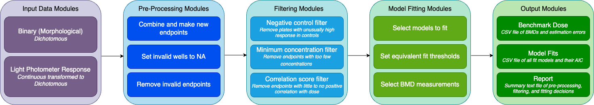

# bmdrc

Python library for the calculation of **B**ench**M**ark **D**ose **R**esponse **C**urves (bmdrc) for binary, continuous, and larval photomotor response data. We suggest using Python version 3.10 or later. 

Please cite: Degnan, D. J., Bramer, L. M., Truong, L., Tanguay, R. L., Gosline, S. M., & Waters, K. M. (2025). bmdrc: Python package for quantifying phenotypes from chemical exposures with benchmark dose modeling. PLOS Computational Biology, 21(7), e1013337.

Read the full paper [here](https://journals.plos.org/ploscompbiol/article?id=10.1371/journal.pcbi.1013337)

# General Schematic 

Originally built to calculate benchmark doses (BMDs) for dichotomous data converted to proportions, *bmdrc* has now been expanded to also fit curves for continuous data.

1. *Input Data Module:* Import data into the python library.

2. *Pre-Processing Module:* Combine and remove endpoints as needed.

3. *Filtering Modules:* Apply recommended filters from the EPA and statistics experts.

4. *Model Fitting Modules:* Fit recommended models from the EPA and statistics experts. The best fit model is auto-selected for you.

5. *Output Modules:* Select tables to output as csvs. View plots in a HTML report.

# How to install the package

First, install the package from pip using:

`pip install bmdrc`

Or from github using:

`pip install git+https://github.com/PNNL-CompBio/bmdrc`

# Package terminology

A phenotype being measured in response to a **chemical** exposure is called an **endpoint**. This can be the presence or absence of a deformity (dichotomous data) or a continuous measurement (like from an assay). Each endpoint has a **response** variable if it can be modeled directly. When a raw measurement needs transormation before modeling (e.g., converting a value of 0 or 1 to a proportional response for dichotomous data), the initial measurement is referred to as a **value**. While not always required, researchers may also track data associated with the **plate**, **well**, and **time** of the experiment for object in specific classes.

# How to use the package

**Dichotomous Data**

- *BinaryClass* The `BinaryClass` object contains specific pre-processing and filtering functions that pertain to plates and wells. Each value should be a 0, 1, or NA, and *bmdrc* will caculate the response column. The following columns are needed for data in long and wide format: chemical, plate, well, concentration. The following columns are only needed for data in wide format: endpoint, value. See a full pipeline demo [here](https://github.com/PNNL-CompBio/bmdrc/blob/main/vignettes/Binary%20Class%20Example.ipynb)

- *ProportionalClass* If your data does not contain plates and wells, the `ProportionalClass` object only requires a chemical, endpoint, concentration, and response (a proportion ranging from 0 to 1). Data must be in long format. See a full pipeline demo [here](https://github.com/PNNL-CompBio/bmdrc/blob/main/vignettes/Proportional%20Class%20Example.ipynb)

- *LPRClass* In the `LPRClass`, larval photomotor response data can be converted to dichotomous as described in [Thomas et al 2019](https://www.sciencedirect.com/science/article/pii/S2468111318300732). Data must be in long format and contain the following columns: chemical, plate, well, concentration, time, and value. Users must specify the time between cycles, the cooldown time between cycles, and whether to start with a light or dark cycle. If this format does not fit your data nicely, please report it to the issues tab. See a full pipeline demo [here](https://github.com/PNNL-CompBio/bmdrc/blob/main/vignettes/LPR%20Class%20Example.ipynb)

Available Models: gamma, log logistic, log probit, logistic, multistage, probit, quantal linear, Weibull

**Continuous Data**

- *ContinuousClass* The `ContinuousClass` object requires only four columns: chemical, endpoint, concentration, and response (a continuous variable with any range). All selected models support negative numbers and zeroes. NA values are automatically filtered out. All models assume that data is meant to be monotonic (increasing/staying the same OR decreasing/staying the same). Thus, there will be one curve. See a full pipeline demo [here](https://github.com/PNNL-CompBio/bmdrc/blob/main/vignettes/Continuous%20Class%20Example.ipynb)

Available Models: asymptotic regression, exponential, Gompertz, Hill, Michaelis-Mentin, power, Weibull

# Example Data and Reports
 
### Example Data 

Example data for dichotomous, proportional, larval photomotor response, and continuous data can be found [here](https://github.com/PNNL-CompBio/bmdrc/tree/main/data).

### Example Report

A sample generated report for: 

* binary (dichotomous)/proportional data can be found [here](https://github.com/PNNL-CompBio/bmdrc/blob/main/example_report/binary_class/Benchmark%20Dose%20Curves.md)

* larval photomotor response (LPR) data can be found [here](https://github.com/PNNL-CompBio/bmdrc/blob/main/example_report/lpr_class/Benchmark%20Dose%20Curves.md)

* continuous data can be found **TODO**

# Logo

Feel free to use our logo when referring to our tool!

