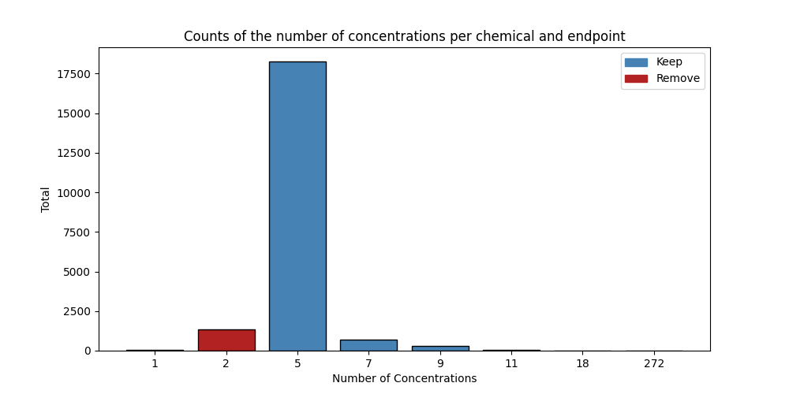

# Benchmark Dose Response Curves

## Input Data

A **binary class** object was created using data in **long** format. The following column names were set:

|Parameter|Column Name|
|---------|-----------|
|Chemical|chemical.id|
|Plate|plate.id|
|Well|well|
|Concentration|conc|
|Endpoint|endpoint|
|Value|value|

## Pre-Processing

#### **Combine & Make New Endpoints**
New endpoints were made using existing endpoints using 'or', which means that if there is any endpoints with a '1', this new endpoint will also have a '1', regardless of how many zeroes there are in the other endpoints. See a summary table of added endpoints below:

|New Endpoint Name|Combined Existing Endpoints|
|---|---|
|ANY24|MO24, DP24, SM24, NC24|
|ANY120|MORT, YSE_, AXIS, EYE_, SNOU, JAW_, OTIC, PE__, BRAI, SOMI, PFIN, CFIN, PIG_, CIRC, TRUN, SWIM, NC__, TR__, ANY24|
|TOT_MORT|MO24, MORT|
|ALL_BUT_MORT|DP24, SM24, NC24, YSE_, AXIS, EYE_, SNOU, JAW_, OTIC, PE__, BRAI, SOMI, PFIN, CFIN, PIG_, CIRC, TRUN, SWIM, NC__, TR__|
|BRN_|BRAI, OTIC, PFIN|
|CRAN|EYE_, SNOU, JAW_|
|EDEM|YSE_, PE__|
|LTRK|TRUN, CFIN|
|MUSC|CIRC, SWIM, SOMI|
|SKIN|PIG_|
|TCHR|TR__|

#### **Set Invalid Wells to NA**

In some cases, like when a sample fish dies, many affected endpoints need to be set to NA. Here, the 'Endpoint Name' column denotes the specific endpoint that sets this rule. In this example, it could be MORT for mortality. Then, the endpoint value needs to be set, which in this case would be a 1 to indicate sample fish that did die. All endpoints would then be set to NA except for cases where the endpoint should not be affected, which are referred to as 'Endpoint Exceptions.'

|Endpoint Name|Endpoint Value|Endpoint Exceptions|
|---|---|---|
|DNC_|1|None|
|MORT|1|DP24, MO24, SM24, MORT|
|MO24|1|MO24|

#### **Remove Invalid Endpoints**

The following endpoints were removed: DNC_

## Filtering

#### **Negative Control Filter**

Plates with unusually high responses in negative control samples were filtered. The response threshold was set to **50.0**. See a summary below:

|Response|Number of Plates|Filter|
|---|---|---|
|0.0|35341|Keep|
|2.0833|3|Keep|
|2.1277|1|Keep|
|2.1739|4|Keep|
|3.125|99|Keep|
|3.2258|32|Keep|
|3.3333|34|Keep|
|3.4483|7|Keep|
|3.5714|16|Keep|
|3.7037|5|Keep|
|4.1667|156|Keep|
|4.2553|1|Keep|
|6.25|3655|Keep|
|6.4516|1|Keep|
|6.6667|875|Keep|
|6.9767|1|Keep|
|7.1429|645|Keep|
|7.6923|363|Keep|
|8.3333|828|Keep|
|9.0909|150|Keep|
|9.375|20|Keep|
|9.6774|4|Keep|
|10.0|64|Keep|
|10.4167|2|Keep|
|10.7143|1|Keep|
|11.1111|22|Keep|
|11.6279|1|Keep|
|12.5|1519|Keep|
|13.3333|137|Keep|
|14.2857|103|Keep|
|15.3846|45|Keep|
|15.625|10|Keep|
|16.6667|181|Keep|
|18.1818|32|Keep|
|18.75|619|Keep|
|20.0|37|Keep|
|20.8333|19|Keep|
|21.4286|18|Keep|
|21.875|1|Keep|
|22.2222|1|Keep|
|23.0769|6|Keep|
|25.0|347|Keep|
|26.6667|6|Keep|
|27.2727|2|Keep|
|28.5714|7|Keep|
|29.1667|1|Keep|
|30.7692|3|Keep|
|31.25|149|Keep|
|33.3333|17|Keep|
|36.3636|2|Keep|
|37.5|101|Keep|
|38.4615|1|Keep|
|40.0|1|Keep|
|41.6667|3|Keep|
|41.9355|1|Keep|
|42.8571|1|Keep|
|43.75|41|Keep|
|50.0|21|Remove|
|56.25|9|Remove|
|62.5|3|Remove|
|68.75|6|Remove|
|75.0|1|Remove|
|100.0|8|Remove|

And here is the plot:

#### **Minimum Concentration Filter**

Endpoints with too few concentration measurements (non-NA) to model are removed. The minimum was set to **3**. See a summary below:

|Number of Concentrations|Number of Endpoints|Filter|
|---|---|---|
|18|23|Keep|
|11|33|Keep|
|9|297|Keep|
|7|693|Keep|
|5|18245|Keep|
|2|1320|Remove|
|1|66|Remove|

And here is the plot:

#### **Correlation Score Filter**

Endpoints with little to no positive correlation with dose are unexpected and should be removed. The correlation threshold was set to **0.2**. See a summary below:

|Correlation Score Bin|Number of Endpoints|
|---|---|
|-1.0|274.0|
|-0.8|914.0|
|-0.6|745.0|
|-0.4|1391.0|
|-0.2|1507.0|
|0.0|6762.0|
|0.2|1958.0|
|0.4|1416.0|
|0.6|2198.0|
|0.8|2136.0|

And here is the plot:

## Model Fitting & Output Modules

#### **Filter Summary**

Overall, 20658 endpoint and chemical combinations were considered. 7707 were deemed eligible for modeling, and 12951 were not based on filtering selections explained in the previous section. Of the 7707 deemed eligible for modeling, 902 did not pass modeling checks.

#### **Model Fitting Selections**

The following model fitting parameters were selected.

|Parameter|Value|Parameter Description|
|---|---|---|
|Goodness of Fit Threshold|0.1|Minimum p-value for fitting a model. Default is 0.1|
|Akaike Information Criterion (AIC) Threshold|2.0|Any models with an AIC within this value are considered an equitable fit. Default is 2.
|Model Selection|lowest BMDL|Either return one model with the lowest BMDL, or combine equivalent fits|

#### **Model Quality Summary**

Below is a summary table of the number of endpoints with a high quality fit (a flag of 1, meaning that the BMD10 value is within the range of measured doses) and those that are not high quality (a flag of 0).

|Flag|Count|
|---|---|
|0|0|
|1|6805|

#### **Output Modules**

Below, see a table of useful methods for extracting outputs from bmdrc.

|Method|Description|
|---|---|
|.bmds|Table of fitted benchmark dose values|
|.bmds_filtered|Table of filtered models not eligible for benchmark dose calculations|
|.output_res_benchmark_dose|Table of benchmark doses for all models, regardless of whether they were filtered or not|
|.p_value_df|Table of goodness of fit p-values for every eligible endpoint|
|.aic_df|Table of Akaike Information Criterion values for every eligible endpoint|
|.response_curve|Plot a benchmark dose curve for an endpoint|

